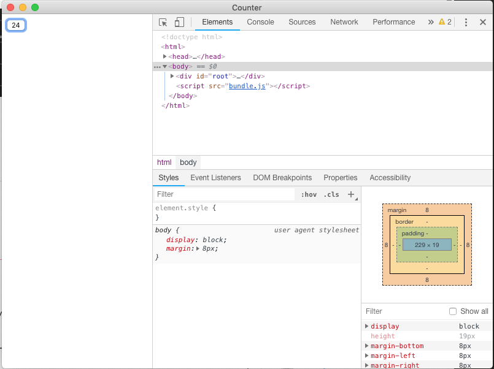

# electron-react-boilerplate-minimal

An Electron, React (16.8) boilerplate for minimalists. Comes with Webpack, Babel, Electron, reactn and an example app using React Hooks.

Uses [electron-quick-start](https://github.com/electron/electron-quick-start) for Electron base. 

Comes with a basic counting app

# How to run

3 simple commands.

`npm install`

`yarn dev`

`yarn start`

# Building for Production

`yarn build`
